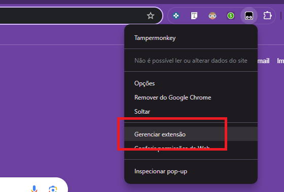
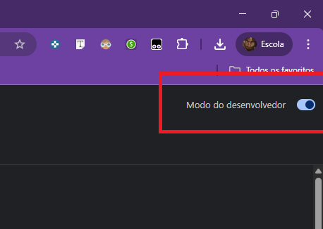
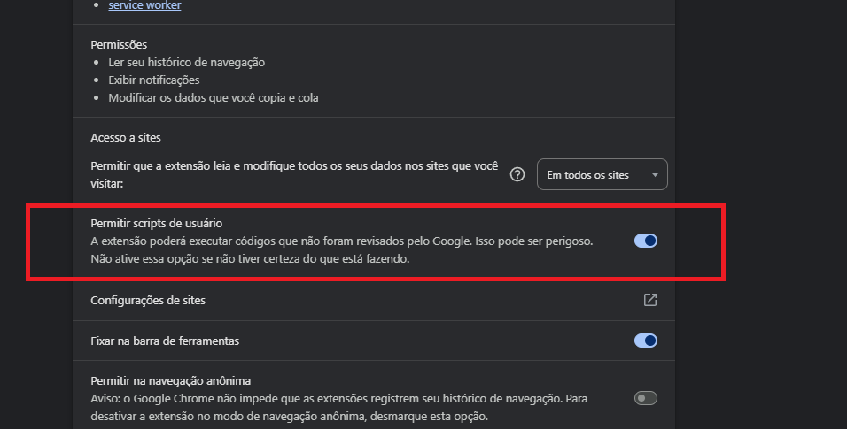
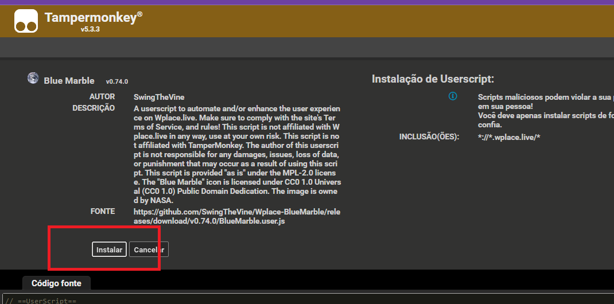
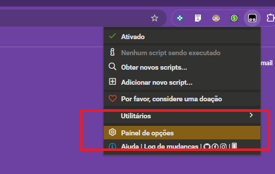
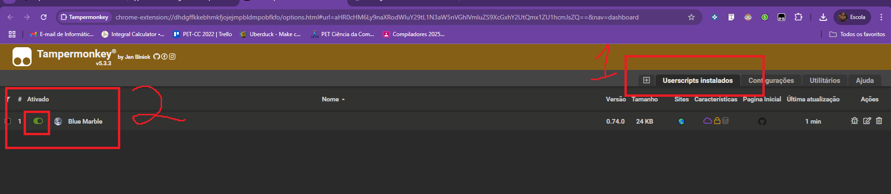
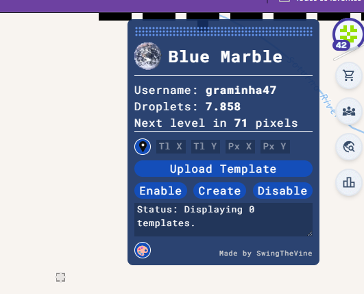
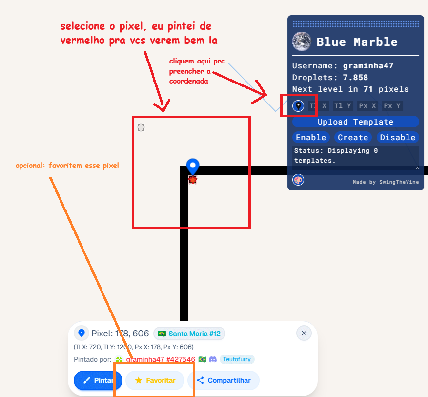
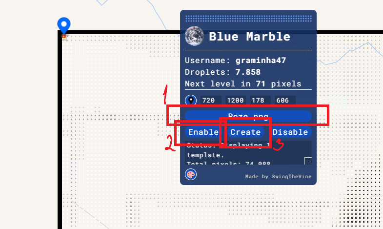
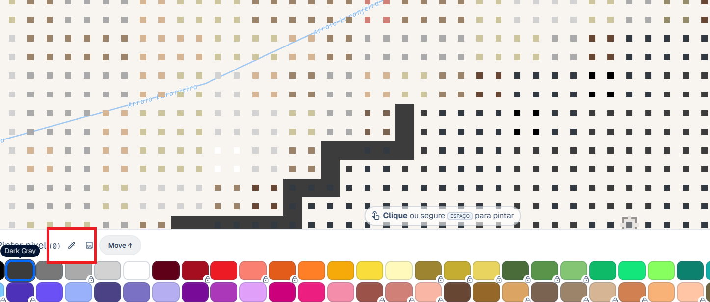

# CTPixxer

Bem-vindo ao tutorial do projeto CTP

O que é **CTP**?

Sim.

Vamos ao passo a passo:

## Passo 1: Instalação da extensão [TamperMonkey](https://www.tampermonkey.net/index.php)

### 1 - Instale a extensão por aqui: [link](https://chromewebstore.google.com/detail/tampermonkey/dhdgffkkebhmkfjojejmpbldmpobfkfo)

### 2 - Com ela instalada, clique com o botão direito nela, lá no canto direito superior, e clique em *gerenciar extensão*

### 3 - Ative o modo de desenvolvedor no canto direito superior

### 4 - Ative a opção **"Permitir scripts de usuário"**

## Passo 2: Instalação da ferramenta de overlay [BlueMarble](https://github.com/SwingTheVine/Wplace-BlueMarble)

### 1 - Clique [aqui](https://github.com/SwingTheVine/Wplace-BlueMarble/releases/download/v0.74.0/BlueMarble.user.js)

### 2 - Você provavelmente foi parar em uma página como essa abaixo, clique então em **instalar**

### 3 - Talvez você tenha que manualmente ativar essa p#rra sla eu instalei faz uns 5 dias já esqueci, aí você faz assim:

## Passo 3: Utilizando a extensão:

### 1 - Dê F5 no wplace, você vai ver a janelinha do BlueMarble aparecer assim:

### 2 - Escolha a coordenada que deseja o overlay
Essa coordenada é referente ao canto esquerdo superior da imagem, no nosso caso usaremos [ESSA](https://wplace.live/?lat=-29.62794418583443&lng=-53.406123378222674&zoom=15.961147715951673), recomendo que favoritem o pixel para mais facil acesso.

### 3 - Clique em Upload Template, escolha a imagem, no nosso caso, [ESSA](https://github.com/Eduardo-Bender/CTPixxer/blob/main/Poze.png)

Depois de escolher a imagem, clique em Enable e então em Create.

### 4 - Dica: Com o overlay, você pode usar o ColorPicker (atalho: "I") no mini quadrado de cor para saber qual é

### pronto bora pintar

 
 
 

# faq

### "mas eu nao tenho chrome eu uso a buxa do brave/operagx"
O tutorial segue o mesmo, voce provavelmente só nao vai achar a opcao de "Permitir Scripts de usuário" nas configurações da extensão, mas isso não importa.

### "eu uso godzila giroflex/safari/[navegador_generico]"
[Se vira](https://github.com/SwingTheVine/Wplace-BlueMarble)
